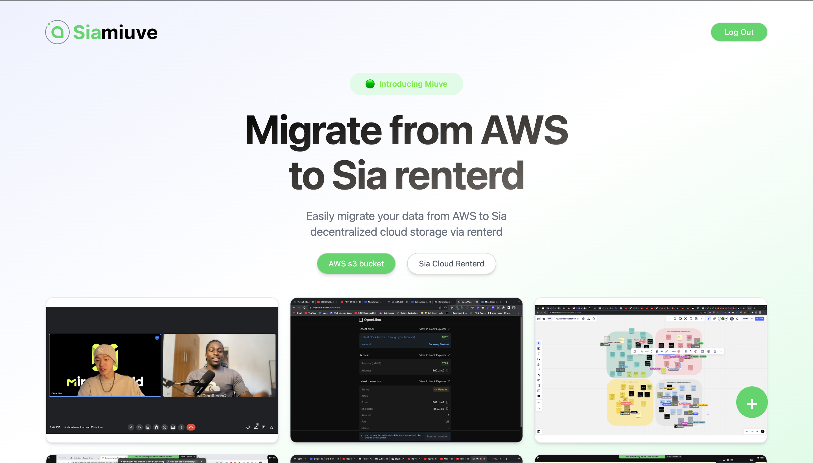

## Building a File Migration Web App from AWS Bucket to Sia renterd using Next.js and TypeScript




## Introduction
In this tutorial, we will explore how to build a web application using Next.js and TypeScript that can migrate files from an AWS bucket to renterd. We will provide a brief introduction to Sia and renterd, followed by step-by-step instructions on building the web app. By the end of this tutorial, you will have a solid understanding of Sia and Sia renterd, and how to migrate files from an AWS bucket to renterd using a web app built with Next.js and TypeScript. We can upload, migrate and delete any file but to keep this tutorial short, we can only preview image files on the browser.

## Demo
We are going to be building something like this [SiaMiuve](https://miuve-86d636.spheron.app/) but won't be going into the entire user interface and user experience and that's because we're trying to keep this tutorial as short as possible. I recommend you go through the app before continuing the tutorial, it's totally worth it!


## What is Sia?
Sia is a decentralized storage platform that leverages blockchain technology to create a secure and efficient storage network. It aims to provide an alternative to traditional cloud storage services by allowing users to store their data on a network of decentralized nodes. Sia's key features include data redundancy, encryption, and micropayments for storage.


## What is decentralized storage?
Decentralized storage refers to a storage model where data is distributed across multiple nodes or computers instead of being stored in a central location. This decentralized approach offers several benefits, such as improved data availability, increased resilience against failures, and enhanced data privacy and security.


## What is renterd?
Renterd is the client software of the Sia network that allows users to interact with the Sia storage platform. It provides functionalities to upload, download, and manage files stored on the Sia network. In our case, we will be using renterd to migrate files from an AWS bucket to the Sia network.


## Building the File Migration Web App

**Prerequisites**
    
- Node.js and npm installed on your machine.
- An AWS account to access and migrate files from an AWS bucket.
- Basic knowledge of Next.js and TypeScript.
- Sia and renterd set up with a reachable API address and API key.
- Text editor or IDE for coding.
- Command Line Interface (CLI) for running commands and scripts.
- Upload some image files to your AWS bucket.


**Disclaimer**

Please do not upload your `.env.local` file. 

## Step 1: Setting up the Next.js Project
1. Create a new Next.js project with TypeScript support by running the following command in your terminal:

   ```shell
   npx create-next-app my-file-migration-app --typescript
   ```
2. Change into the project directory:

    ```shell
    cd my-file-migration-app
    ```

## Step 2: Installing Dependencies

 1. Install the AWS SDK for JavaScript:
 
 ```shell
 npm install aws-sdk
```
    

## Step 3: Setting up AWS Credentials
Before accessing your AWS bucket, you need to set up AWS credentials. These credentials will be used by the utility to authenticate and authorize your access to AWS services. Follow the steps below to set up AWS credentials:

1. Log in to the AWS Management Console.

2. Open the IAM (Identity and Access Management) service.

3. Navigate to "Users" and click on "Add user" to create a new user.

4. Provide a name for the user and enable programmatic access.

5. Attach appropriate permissions to the user. For this tutorial, you will need "AmazonS3ReadOnlyAccess" permission for the user.

6. Complete the user creation process and make note of the Access Key ID and Secret Access Key. 

7. In your Next.js project, create a file named `.env.local` in the root directory.

8. Add the following content to the `.env.local` file:

```env
AWS_ACCESS_KEY_ID=<your-access-key-id>
AWS_SECRET_ACCESS_KEY=<your-secret-access-key>
```
> Replace < your-access-key-id > and < your-secret-access-key > with your actual AWS credentials.

## Next.js .env.local configuration

Navigate into your `next.config.js` file and add the below env configuration:

```js
const nextConfig = {
  env: {
    AWS_ACCESS_KEY: process.env.AWS_ACCESS_KEY,
    AWS_SECRET_ACCESS_KEY: process.env.AWS_SECRET_ACCESS_KEY,
  },
}; 
```

## Step 4: Create utils files

###  In your Next.js project, create a new file named utils/s3Utils.ts and add the following code to you s3Utils file:
   
```ts
import AWS from "aws-sdk";

//Configure AWS
AWS.config.update({
  accessKeyId: process.env.AWS_ACCESS_KEY,
  secretAccessKey: process.env.AWS_SECRET_ACCESS_KEY,
  region: "us-east-1",
  signatureVersion: "v4",
});

//Initialize S3
const s3 = new AWS.S3();

//Handles S3 file deletion
export const handleS3Delete = (key: string) => {
  console.log("Deleting file...");

  const params = {
    Bucket: "YOUR_BUCKET_NAME",
    Key: key,
  };
  s3.deleteObject(params, (error) => {
    if (error) {
      console.error("Error deleting file:", error);
    } else {
      console.log("File deleted successfully");
    }
  });
};

//Handles S3 file upload
export const downloadFromS3 = async (): Promise<any[]> => {
  console.log("Downloading...");
  const params = {
    Bucket: "YOUR_BUCKET_NAME",
  };

  return new Promise((resolve, reject) => {
    s3.listObjectsV2(params, (err, data) => {
      if (err) {
        console.log(err);
        reject(err);
      } else {
        const fileKeys: any = data.Contents?.map((file) => {
          return {
            key: file.Key,
            //This returns the file url(key) so we are making another request with each key to get the actual file content using a seperate function(convertUrlToFilePath) to make our code cleaner
            url: convertUrlToFile(file.Key),
            body: file,
          };
        });
        resolve(fileKeys);
        console.log("Done Downloading...");
      }
    });
  });
};

//handles S3 file upload
export const uploadToS3 = async (selectedFile: File) => {
  console.log("Uploading...");

  const s3 = new AWS.S3();
  if (!selectedFile) {
    return;
  }
  try {
    const params = {
      Bucket: "YOUR_BUCKET_NAME",
      Key: `${Date.now()}.${selectedFile.name}` || "",
      Body: selectedFile,
    };
    await s3.upload(params).promise();
    console.log("Done Uploading!");
  } catch (err) {
    console.log(err);
  }
};

//Gets file content based on the file key
export const convertUrlToFile = (key: any) => {
  const params = {
    Bucket: "YOUR_BUCKET_NAME",
    Key: key,
  };
  const signedUrl = s3.getSignedUrl("getObject", params);
  return signedUrl;
};
```

## Constants.ts
We need to store a few things we are going to use repeatedly in a file where we can access them easily.
```ts
export const API_ENDPOINT = `https://renterd-mock.sia.tools/api/worker/objects/`;
export const REGISTER_ENDPOINT = `https://renterd-mock.sia.tools/api/test/register`;

```

- In your Next.js project, create a new file named utils/siaUtil.ts and add the following code to your constants.ts file:

## In your Next.js project, create a new file named utils/siaUtils.ts add the following code to your siaUtils file:

Handles user registration because we are going to need to use the token to make every other request to renterd API endpoints for now we are going to store it in our local storage.

```ts 
import { API_ENDPOINT, REGISTER_ENDPOINT } from "../constants";
export const register = async () => {
  return fetch(REGISTER_ENDPOINT, {
    method: "POST",
    redirect: "follow",
  })
    .then(async (res) => await res.json())
    .then((result) => {
      window.localStorage.setItem("token", JSON.stringify(result));
      return result;
    })
    .catch((err) => console.log(err));
};
```
Simulates user logout by removing registration token from browser's local storage
```ts
export const logOut = () => {
  window.localStorage.removeItem("token");
  window.location.reload();
};
```

When uploading the file to renderd, if you upload to a base directory like ```/documents``` the file gets uploaded successfully, however, if you upload another file to that same directory, it replaces the one that was previously there but we'd like to upload multiple files so we can still fetch all of them instead of the previous one getting replaced, to do that we are going to create a new path name for every file we are uploading and because we are not 100% sure of that all our files have a unique name, we are going to generate a random path name for each file, there are other ways to do this to ensure uniqueness of file name but for the purpose of this tutorial, we are going to use the inbuilt JavaScript Maths.random() method.
```ts
export const uploadToRenterd = async (file: File) => {
  console.log("Uploading...");
  const password = window.localStorage.getItem("token");
  const username = "";
  const authHeader =
    "Basic " + btoa(username + ":" + JSON.parse(password as string));
  const path = (Math.random() + 1).toString(36).substring(7);

  await fetch(`${API_ENDPOINT}documents/${path}`, {
    method: "PUT",
    redirect: "follow",
    body: file,
    headers: {
      Authorization: authHeader,
    },
  })
    .then(async (res) => {
      await res.text();
      console.log("File uploaded successfully!");
    })
    .catch((err) => console.log(err));
};
```

Because we need to download all the files we have uploaded so that we can probably render them on the screen or for any other purpose, we need to make a ```GET``` request to our base directory which in our case is ```/documents```, this will return an array of an object containing name and sizes of the files we've uploaded previously, this is cool but one thing is missing, we want the file contents too, so we can preview them like we need to do in our demo app.
```ts
export const downloadFromRentred = async () => {
  console.log("Downloading file");

  const password = window.localStorage.getItem("token");
  const username = "";

  const authHeader =
    "Basic " + btoa(username + ":" + JSON.parse(password as string));

  const res = await fetch(`${API_ENDPOINT}documents`, {
    method: "GET",
    headers: {
      Accept: "application/json",
      Authorization: authHeader,
    },
  });
  const newRes = await res.json();

  const urls = await Promise.all(
    newRes.map(async (res: { name: string }) => {
      const url = await getBase64Url(res.name, authHeader);
      return { name: res.name, url: url };
    })
  );
  console.log("Fils downloaded successfully!");
  return urls;
};
```

Here we are getting individual file contents and converting them to base64 so we can render/preview them on the on web app.
```ts
export const getBase64Url = (name: string, authHeader: any) => {
  return new Promise(async (resolve, reject) => {
    const singleResponse = await fetch(
      `${API_ENDPOINT}documents/${name}`,
      {
        method: "GET",
        headers: {
          Accept: "application/json",
          Authorization: authHeader,
        },
      }
    );
    const data = await singleResponse.blob();
    const blob = new Blob([data], {});
    const reader = new FileReader();
    reader.readAsDataURL(blob);
    reader.onloadend = async () => {
      resolve(reader.result?.toString());
    };
    reader.onerror = function (err) {
      reject(err);
    };
  });
};
```


Deletes  file from your rendterd files directory using the file name
```ts
export const handleSiaDelete = (key: string) => {
  console.log("deleteing...");

  const password = window.localStorage.getItem("token");
  const username = "";
  const authHeader =
    "Basic " + btoa(username + ":" + JSON.parse(password as string));
  fetch(`${API_ENDPOINT}documents/${key}`, {
    method: "DELETE",
    redirect: "follow",
    headers: {
      Authorization: authHeader,
    },
  })
    .then(async (res) => {
      await res.text();
    })
    .catch((err) => console.log(err));
};
```

## Step 5: Create the migration page

1. Add the following content to the page.tsx file:


```tsx 
"use client";

import { useEffect, useState } from "react";
import { downloadFromS3 } from "../../utils/s3Utils";
import Image from "next/image";

export default function Migrate() {
  const [fileList, setFileList] = useState<any[]>([]);
  console.log(fileList);

  useEffect(() => {
    const getS3files = async () => {
      const files = await downloadFromS3();
      setFileList(files);
    };
    getS3files();
  }, []);

  const handleMigrate = async (file: string) => {
    console.log("Migrating");
  };

  return (
    <div>
      <h1>File Migration</h1>
      <ul>
        {fileList.map((file) => (
          <li key={file.key}>
            <Image src={file.url} height={300} width={300} alt="Image from s3" />
            <button onClick={() => handleMigrate(file)}>Migrate</button>
          </li>
        ))}
      </ul>
    </div>
  );
}

//Modify UI to your taste

```

Update your ```next.config.ts``` file with the below configuration to be able to view images from our s3 bucket:

```ts
/** @type {import('next').NextConfig} */
const nextConfig = {
  images: {
    domains: ["s3.amazonaws.com", "miuve.s3.amazonaws.com"],
  },
  env: {
    AWS_ACCESS_KEY: process.env.AWS_ACCESS_KEY,
    AWS_SECRET_ACCESS_KEY: process.env.AWS_SECRET_ACCESS_KEY,
  },
};

module.exports = nextConfig;
```

Next, we need to do is to create another utils file and write the functions that are going to help us migrate any file from the files we just fetched from s3 to renterd, to do that, create a new file with the name migrate.ts inside our utils folder and add the following codes:

```ts
import { downloadFromRentred, uploadToRenterd } from "./siaUtils";

export const getFileNameFromUrl = (url: any) => {
  const urlParts = url.split("/");
  return urlParts[urlParts.length - 1];
};

export const createFileFromFileUrl = async (imageUrl: any) => {
  const response = await fetch(imageUrl);
  const blob = await response.blob();
  const fileName = getFileNameFromUrl(imageUrl);
  const file = new File([blob], fileName, { type: blob.type });

  return file;
};

export const handleMigration = (file: any) => {
  createFileFromFileUrl(file.url)
    .then(async (file) => {
      await uploadToRenterd(file);
      await downloadFromRentred();
    })
    .catch((error) => {
      console.error(error);
    });
};

```


In the above code example, we have a function name `handleMigration` which handles the migration of files from s3 to renterd, what we need to migrate is a file and not a file url but what we are getting from s3 bucket is a file URL so to fix that we introduced another function which helps us create a file object from the file url, then we also have another function that takes in file url and then returns filename which we then pass in as the name of the new file object. A summary of what we did is that:
* We got the file name
* Create a new file project from file URL
* Upload the file to sia renterd
* Then download our sia renterd files so we can see the new file we just migrated from our s3 bucket.


Now we need to go back to our `page.tsx` and update our handleMigration function: 

```tsx
"use client";

import { useEffect, useState } from "react";
import { downloadFromS3 } from "../../utils/s3Utils";
import Image from "next/image";
import { handleMigration } from "../../utils/migrate";

export default function Migrate() {
  const [fileList, setFileList] = useState<any[]>([]);

  useEffect(() => {
    const getS3files = async () => {
      const files = await downloadFromS3();
      setFileList(files);
    };
    getS3files();
  }, []);

  const handleMigrate = async (file: string) => {
    handleMigration(file);
  };

  return (
    <div>
      <h1>File Migration</h1>
      <ul>
        {fileList.map((file) => (
          <li key={file.key}>
            <Image
              src={file.url.split("?")[0]}
              height={300}
              width={300}
              alt="Image from s3"
            />
            <button onClick={() => handleMigrate(file)}>Migrate</button>
          </li>
        ))}
      </ul>
    </div>
  );
}
```

### Test 
Start the Next.js development server by running the following command in your project directory:
   
   ```shell
   npm run dev
   ```
If you click on the migrate button you'll get a `401` error and that's because we're trying to upload to renterd without our auth token, we've written the function but we've not called it so let's fix that, we need to update our page.tsx to enable us resiter:

```html
<button onClick={() => register()}>Register</button>
```
Also remember to import the function at the top of your file

```tsx
import { register } from "../../utils/siaUtils";
```

Now let's try to migrate a file again. Firstly, click on the register button and then click on migrate button.

Yeahh!🎊 it's working! we just succesfully migrated and we are also fetching the file! contratulations! 

let's get the our app to display our sia file on the screen

## Bonus
You can also upload friles directly to renterd and even delete them, we already have the functions written in our siaUtil file:

```tsx
"use client";

import { useEffect, useState } from "react";
import { downloadFromS3 } from "../../utils/s3Utils";
import Image from "next/image";
import { handleMigration } from "../../utils/migrate";
import { downloadFromRentred, register } from "../../utils/siaUtils";

export default function Migrate() {
  const [fileList, setFileList] = useState<any[]>([]);
  const [siafiles, setSiaFiles] = useState<any[]>([]);

  useEffect(() => {
    const getS3files = async () => {
      const files = await downloadFromS3();
      setFileList(files);
      const files2 = await downloadFromRentred();
      setSiaFiles(files2);
    };
    getS3files();
  }, []);

  const handleMigrate = async (file: string) => {
    handleMigration(file);
  };

  return (
    <div>
      <h1>File Migration</h1>
      <button onClick={() => register()}>Register</button>
      <h1>S3 files</h1>
      <ul>
        {fileList.map((file) => (
          <li key={file.key}>
            <Image
              src={file.url.split("?")[0]}
              height={300}
              width={300}
              alt="Image from s3"
            />
            <button onClick={() => handleMigrate(file)}>Migrate</button>
          </li>
        ))}
      </ul>
      <h1>Sia files</h1>
      <ul>
        {siafiles.map((file) => (
          <li key={file.name}>
            <Image
              src={file.url}
              height={300}
              width={300}
              alt="Image from s3"
            />
          </li>
        ))}
      </ul>
    </div>
  );
}

```

# Summary

Now you have your project up and running, here are a few resources to help you learn more about Sia and decentralized storage systems and also join our vibrant community!

You can find the codebase link below and if you have any questions please don't hesitate to reach out to us on Discord!


Demo Project link: https://miuve-86d636.spheron.app/

Sia website: https://sia.tech/

Sia Documentation: https://docs.sia.tech/get-started-with-sia/sia101

Sia Community: https://discord.gg/sia

Project repo: https://github.com/


# Distribution Strategy
For the distribution strategy, we can adopt a couple of options or even go with the most effective one but let's figure out who our target audience is. We can say that our target audience is Software Engineers, Blockchain and cryptocurrency communities, Startups, and small businesses that are looking for cost-effective cloud storage solutions, and even Data sensitive industries such as Health care, Finance, and the legal sector. To reach these people, we can adopt a few methods:

- **Blog Post:** Publishing the tutorial as a blog post will help us reach a set of developers who want to get an idea of how sia works and how to work with and integrate with other platforms, developers who need to see working code examples to give them an idea of how to work with Sia, and blog post has little to no maintenance(Updating) required which in turn saves time and resources.

- **Tutorial Video:** Making and publishing a video tutorial will help us achieve the same as a blog but now reach people who are visual learners.

- **Developer Conferences/Hackathon:** This method to me is the most effective, especially for promoting Sia platform and engaging with developers in real-time, this enhances networking and relationship building because face-to-face interactions allow for personal connections and relationship building, which can lead to stronger collaborations, partnerships, and future opportunities. Meeting developers in person fosters trust and facilitates deeper conversations compared to virtual interactions and also helps us get feedback in real-time


1. **Include in Documentation:** Including the tutorial as part of getting started in Sia renterd documentation will help us reach the curious ones who want to build and are looking for code on how to get started.
